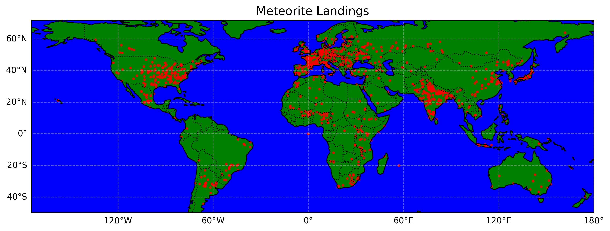
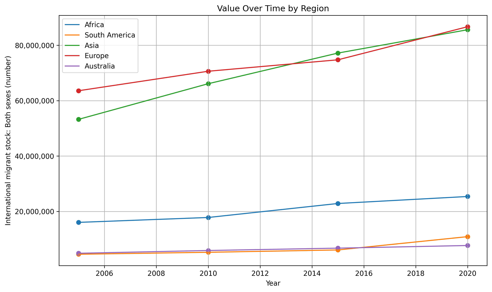

# proj02

## Meteorites on the Map

The graph above displays the geographic locations of meteorite landings across the globe, plotted with latitude and longitude coordinates. Each point represents a recorded meteorite fall, overlaid on a world map. Data used in this graph can be found at this link: https://data.nasa.gov/resource/y77d-th95.json

## Immigration Population

The graph above shows the total number of immigrants in each continent as recorded by the UN. The data was recorded for 2005, 2010, 2015, and 2020. Data used in this graph can be found at this link: https://data.un.org/_Docs/SYB/CSV/SYB67_327_202411_International%20Migrants%20and%20Refugees.csv

### Project Instructions
https://github.com/mikeizbicki/cmc-csci040/blob/2025spring/project_02_visualizing_datasets/README.md
